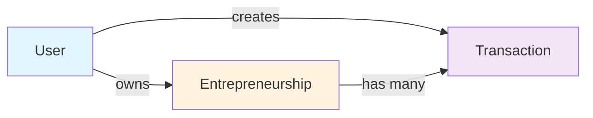

# Modelo de Emprendimientos - CajaClara

## Descripción General

El modelo de emprendimientos permite a los usuarios asociar transacciones con sus negocios o emprendimientos específicos. Esto facilita el seguimiento financiero separado por negocio.

## Relación con Transacciones



## Modelo SQLAlchemy

### Archivo: `backend/app/models/entrepreneurship.py`

```python
"""
Modelo de emprendimientos para asociar transacciones con negocios específicos.
"""

from sqlalchemy import Boolean, Column, String, Text
from sqlalchemy.dialects.postgresql import UUID
from sqlalchemy.orm import relationship

from app.models.base import Base, TimestampMixin, UUIDMixin


class Entrepreneurship(Base, UUIDMixin, TimestampMixin):
    """Modelo de emprendimiento o negocio del usuario"""

    __tablename__ = "entrepreneurships"
    __table_args__ = (
        {"comment": "Emprendimientos o negocios de los usuarios"},
    )

    # Foreign Keys
    user_id = Column(
        UUID(as_uuid=True),
        ForeignKey("users.id", ondelete="CASCADE"),
        nullable=False,
        index=True,
        comment="Usuario propietario"
    )

    # Business Data
    name = Column(
        String(255),
        nullable=False,
        comment="Nombre del emprendimiento"
    )

    description = Column(
        Text,
        nullable=True,
        comment="Descripción del emprendimiento"
    )

    business_type = Column(
        String(100),
        nullable=True,
        comment="Tipo de negocio (ej: retail, services, manufacturing)"
    )

    is_active = Column(
        Boolean,
        default=True,
        nullable=False,
        index=True,
        comment="Si el emprendimiento está activo"
    )

    # Relationships
    user = relationship(
        "User",
        back_populates="entrepreneurships"
    )

    transactions = relationship(
        "Transaction",
        back_populates="entrepreneurship",
        cascade="all, delete-orphan"
    )

    def __repr__(self) -> str:
        return f"<Entrepreneurship(id={self.id}, name={self.name}, user_id={self.user_id})>"
```

## Actualización del Modelo User

```python
# En app/models/user.py, agregar:

class User(Base, UUIDMixin, TimestampMixin):
    # ... existing fields ...

    # Relationships
    transactions = relationship(
        "Transaction",
        back_populates="user",
        foreign_keys="Transaction.user_id",
        cascade="all, delete-orphan"
    )

    entrepreneurships = relationship(
        "Entrepreneurship",
        back_populates="user",
        cascade="all, delete-orphan"
    )

    category_rules = relationship(
        "CategoryRule",
        back_populates="user",
        cascade="all, delete-orphan"
    )
```

## Actualización del Modelo Transaction

```python
# En app/models/transaction.py, agregar:

class Transaction(Base, UUIDMixin, TimestampMixin, SoftDeleteMixin, AuditMixin):
    # ... existing fields ...

    entrepreneurship_id = Column(
        UUID(as_uuid=True),
        ForeignKey("entrepreneurships.id", ondelete="SET NULL"),
        nullable=True,
        index=True,
        comment="Emprendimiento asociado (opcional)"
    )

    # ... existing fields ...

    # Relationships
    user = relationship(
        "User",
        back_populates="transactions",
        foreign_keys=[user_id]
    )

    entrepreneurship = relationship(
        "Entrepreneurship",
        back_populates="transactions"
    )

    category = relationship(
        "Category",
        back_populates="transactions"
    )
```

## Schemas Pydantic

### Archivo: `backend/app/schemas/entrepreneurship.py`

```python
"""
Schemas para emprendimientos.
"""

from datetime import datetime
from typing import Optional
from uuid import UUID

from pydantic import BaseModel, Field


class EntrepreneurshipBase(BaseModel):
    """Base schema para emprendimiento"""

    name: str = Field(max_length=255, description="Nombre del emprendimiento")
    description: Optional[str] = Field(None, description="Descripción")
    business_type: Optional[str] = Field(None, max_length=100)
    is_active: bool = True


class EntrepreneurshipCreate(EntrepreneurshipBase):
    """Schema para crear emprendimiento"""
    pass


class EntrepreneurshipUpdate(BaseModel):
    """Schema para actualizar emprendimiento"""

    name: Optional[str] = Field(None, max_length=255)
    description: Optional[str] = None
    business_type: Optional[str] = Field(None, max_length=100)
    is_active: Optional[bool] = None


class EntrepreneurshipResponse(EntrepreneurshipBase):
    """Schema de respuesta de emprendimiento"""

    id: UUID
    user_id: UUID
    created_at: datetime
    updated_at: datetime

    model_config = {"from_attributes": True}


class EntrepreneurshipListResponse(BaseModel):
    """Lista de emprendimientos"""

    entrepreneurships: list[EntrepreneurshipResponse]
```

## Repositorio

### Archivo: `backend/app/repositories/entrepreneurship.py`

```python
"""
Repositorio para emprendimientos.
"""

from typing import List, Optional
from uuid import UUID

from sqlalchemy import and_, select
from sqlalchemy.ext.asyncio import AsyncSession

from app.models.entrepreneurship import Entrepreneurship
from app.repositories.base import BaseRepository


class EntrepreneurshipRepository(BaseRepository[Entrepreneurship]):
    """Repositorio para operaciones de emprendimientos"""

    def __init__(self, db: AsyncSession):
        super().__init__(Entrepreneurship, db)

    async def get_by_user_id(
        self,
        user_id: UUID,
        active_only: bool = True
    ) -> List[Entrepreneurship]:
        """
        Obtiene emprendimientos de un usuario.

        Args:
            user_id: UUID del usuario
            active_only: Si solo retornar activos

        Returns:
            Lista de emprendimientos
        """
        conditions = [Entrepreneurship.user_id == user_id]

        if active_only:
            conditions.append(Entrepreneurship.is_active == True)

        query = select(Entrepreneurship).where(and_(*conditions))
        query = query.order_by(Entrepreneurship.name)

        result = await self.db.execute(query)
        return list(result.scalars().all())

    async def get_by_id_and_user(
        self,
        entrepreneurship_id: UUID,
        user_id: UUID
    ) -> Optional[Entrepreneurship]:
        """
        Obtiene emprendimiento verificando propiedad.

        Args:
            entrepreneurship_id: UUID del emprendimiento
            user_id: UUID del usuario propietario

        Returns:
            Emprendimiento o None
        """
        result = await self.db.execute(
            select(Entrepreneurship).where(
                and_(
                    Entrepreneurship.id == entrepreneurship_id,
                    Entrepreneurship.user_id == user_id
                )
            )
        )
        return result.scalar_one_or_none()
```

## Servicio

### Archivo: `backend/app/services/entrepreneurship.py`

```python
"""
Servicio de lógica de negocio para emprendimientos.
"""

from uuid import UUID

from app.core.exceptions import NotFoundError, ValidationError
from app.repositories.entrepreneurship import EntrepreneurshipRepository
from app.schemas.entrepreneurship import (
    EntrepreneurshipCreate,
    EntrepreneurshipResponse,
    EntrepreneurshipUpdate,
)


class EntrepreneurshipService:
    """Servicio para gestión de emprendimientos"""

    def __init__(self, entrepreneurship_repo: EntrepreneurshipRepository):
        self.entrepreneurship_repo = entrepreneurship_repo

    async def create_entrepreneurship(
        self,
        user_id: UUID,
        data: EntrepreneurshipCreate
    ) -> EntrepreneurshipResponse:
        """
        Crea un nuevo emprendimiento.

        Args:
            user_id: UUID del usuario
            data: Datos del emprendimiento

        Returns:
            Emprendimiento creado
        """
        entrepreneurship_data = {
            "user_id": user_id,
            **data.model_dump()
        }

        entrepreneurship = await self.entrepreneurship_repo.create(entrepreneurship_data)
        return EntrepreneurshipResponse.model_validate(entrepreneurship)

    async def get_entrepreneurship(
        self,
        entrepreneurship_id: UUID,
        user_id: UUID
    ) -> EntrepreneurshipResponse:
        """
        Obtiene detalle de emprendimiento.

        Args:
            entrepreneurship_id: UUID del emprendimiento
            user_id: UUID del usuario propietario

        Returns:
            Emprendimiento

        Raises:
            NotFoundError: Si no existe o no pertenece al usuario
        """
        entrepreneurship = await self.entrepreneurship_repo.get_by_id_and_user(
            entrepreneurship_id,
            user_id
        )

        if entrepreneurship is None:
            raise NotFoundError(
                code="ENTREPRENEURSHIP_NOT_FOUND",
                message="Entrepreneurship not found"
            )

        return EntrepreneurshipResponse.model_validate(entrepreneurship)

    async def list_entrepreneurships(
        self,
        user_id: UUID,
        active_only: bool = True
    ) -> list[EntrepreneurshipResponse]:
        """
        Lista emprendimientos del usuario.

        Args:
            user_id: UUID del usuario
            active_only: Si solo retornar activos

        Returns:
            Lista de emprendimientos
        """
        entrepreneurships = await self.entrepreneurship_repo.get_by_user_id(
            user_id,
            active_only
        )

        return [
            EntrepreneurshipResponse.model_validate(e)
            for e in entrepreneurships
        ]

    async def update_entrepreneurship(
        self,
        entrepreneurship_id: UUID,
        user_id: UUID,
        data: EntrepreneurshipUpdate
    ) -> EntrepreneurshipResponse:
        """
        Actualiza un emprendimiento.

        Args:
            entrepreneurship_id: UUID del emprendimiento
            user_id: UUID del usuario propietario
            data: Datos a actualizar

        Returns:
            Emprendimiento actualizado

        Raises:
            NotFoundError: Si no existe o no pertenece al usuario
        """
        entrepreneurship = await self.entrepreneurship_repo.get_by_id_and_user(
            entrepreneurship_id,
            user_id
        )

        if entrepreneurship is None:
            raise NotFoundError(
                code="ENTREPRENEURSHIP_NOT_FOUND",
                message="Entrepreneurship not found"
            )

        update_data = data.model_dump(exclude_unset=True)
        updated = await self.entrepreneurship_repo.update(
            entrepreneurship_id,
            update_data
        )

        return EntrepreneurshipResponse.model_validate(updated)

    async def delete_entrepreneurship(
        self,
        entrepreneurship_id: UUID,
        user_id: UUID
    ) -> None:
        """
        Elimina un emprendimiento (hard delete).

        Args:
            entrepreneurship_id: UUID del emprendimiento
            user_id: UUID del usuario propietario

        Raises:
            NotFoundError: Si no existe o no pertenece al usuario
        """
        entrepreneurship = await self.entrepreneurship_repo.get_by_id_and_user(
            entrepreneurship_id,
            user_id
        )

        if entrepreneurship is None:
            raise NotFoundError(
                code="ENTREPRENEURSHIP_NOT_FOUND",
                message="Entrepreneurship not found"
            )

        await self.entrepreneurship_repo.delete(entrepreneurship_id)
```

## Endpoints API

### Archivo: `backend/app/api/v1/endpoints/entrepreneurships.py`

```python
"""
Endpoints para gestión de emprendimientos.
"""

from uuid import UUID

from fastapi import APIRouter, Depends, HTTPException, status
from sqlalchemy.ext.asyncio import AsyncSession

from app.api.deps import get_current_user
from app.db.database import get_db
from app.models.user import User
from app.repositories.entrepreneurship import EntrepreneurshipRepository
from app.schemas.entrepreneurship import (
    EntrepreneurshipCreate,
    EntrepreneurshipListResponse,
    EntrepreneurshipResponse,
    EntrepreneurshipUpdate,
)
from app.services.entrepreneurship import EntrepreneurshipService

router = APIRouter(prefix="/entrepreneurships", tags=["Entrepreneurships"])


@router.post("", response_model=EntrepreneurshipResponse, status_code=status.HTTP_201_CREATED)
async def create_entrepreneurship(
    data: EntrepreneurshipCreate,
    current_user: User = Depends(get_current_user),
    db: AsyncSession = Depends(get_db)
) -> EntrepreneurshipResponse:
    """Crea un nuevo emprendimiento"""
    repo = EntrepreneurshipRepository(db)
    service = EntrepreneurshipService(repo)
    return await service.create_entrepreneurship(current_user.id, data)


@router.get("", response_model=EntrepreneurshipListResponse)
async def list_entrepreneurships(
    active_only: bool = True,
    current_user: User = Depends(get_current_user),
    db: AsyncSession = Depends(get_db)
) -> EntrepreneurshipListResponse:
    """Lista emprendimientos del usuario"""
    repo = EntrepreneurshipRepository(db)
    service = EntrepreneurshipService(repo)
    entrepreneurships = await service.list_entrepreneurships(
        current_user.id,
        active_only
    )
    return EntrepreneurshipListResponse(entrepreneurships=entrepreneurships)


@router.get("/{entrepreneurship_id}", response_model=EntrepreneurshipResponse)
async def get_entrepreneurship(
    entrepreneurship_id: UUID,
    current_user: User = Depends(get_current_user),
    db: AsyncSession = Depends(get_db)
) -> EntrepreneurshipResponse:
    """Obtiene detalle de emprendimiento"""
    repo = EntrepreneurshipRepository(db)
    service = EntrepreneurshipService(repo)
    return await service.get_entrepreneurship(entrepreneurship_id, current_user.id)


@router.put("/{entrepreneurship_id}", response_model=EntrepreneurshipResponse)
async def update_entrepreneurship(
    entrepreneurship_id: UUID,
    data: EntrepreneurshipUpdate,
    current_user: User = Depends(get_current_user),
    db: AsyncSession = Depends(get_db)
) -> EntrepreneurshipResponse:
    """Actualiza un emprendimiento"""
    repo = EntrepreneurshipRepository(db)
    service = EntrepreneurshipService(repo)
    return await service.update_entrepreneurship(
        entrepreneurship_id,
        current_user.id,
        data
    )


@router.delete("/{entrepreneurship_id}", status_code=status.HTTP_204_NO_CONTENT)
async def delete_entrepreneurship(
    entrepreneurship_id: UUID,
    current_user: User = Depends(get_current_user),
    db: AsyncSession = Depends(get_db)
) -> None:
    """Elimina un emprendimiento"""
    repo = EntrepreneurshipRepository(db)
    service = EntrepreneurshipService(repo)
    await service.delete_entrepreneurship(entrepreneurship_id, current_user.id)
```

## Integración en Transacciones

Al crear o actualizar transacciones, ahora se puede asociar con un emprendimiento:

```python
# En CreateManualTransactionRequest
class CreateManualTransactionRequest(BaseModel):
    amount: Decimal = Field(gt=0, decimal_places=2)
    currency: str = Field(default="COP", pattern="^(COP|USD|EUR)$")
    category_id: str
    entrepreneurship_id: Optional[UUID] = None  # NUEVO
    description: Optional[str] = Field(None, max_length=500)
    transaction_type: Literal["income", "expense"]
    classification: Literal["personal", "business"]
    transaction_date: datetime
    tags: Optional[List[str]] = None

# En TransactionResponse
class TransactionResponse(BaseModel):
    id: UUID
    user_id: UUID
    entrepreneurship_id: Optional[UUID]  # NUEVO
    amount: Decimal
    # ... rest of fields ...
```

## Migraciones Alembic

```bash
# Crear migración para agregar tabla entrepreneurships
uv run alembic revision --autogenerate -m "Add entrepreneurships table and relation to transactions"

# Aplicar migración
uv run alembic upgrade head
```

## Casos de Uso

1. **Usuario con múltiples negocios:** Puede crear un emprendimiento para cada negocio y asociar transacciones
2. **Seguimiento separado:** Cada emprendimiento tiene su propio historial de transacciones
3. **Reportes por negocio:** Exportar transacciones filtradas por emprendimiento
4. **Análisis financiero:** Comparar rendimiento entre emprendimientos

---

**Versión:** 1.0  
**Fecha:** 2025-10-28  
**Autor:** CajaClara Team
