# Arquitectura Técnica - CajaClara Backend

Documentación completa de la arquitectura técnica del backend, incluyendo diseño de la API, base de datos, y flujos de trabajo.

## 📋 Tabla de Contenidos

- [Visión General](#visión-general)
- [Arquitectura de Capas](#arquitectura-de-capas)
- [Base de Datos](#base-de-datos)
- [API REST](#api-rest)
- [Flujos de Trabajo](#flujos-de-trabajo)
- [Seguridad](#seguridad)

## Visión General

CajaClara Backend es una API RESTful construida con FastAPI que sigue una arquitectura de capas limpia, separando responsabilidades y facilitando el mantenimiento y escalabilidad.

### Stack Tecnológico

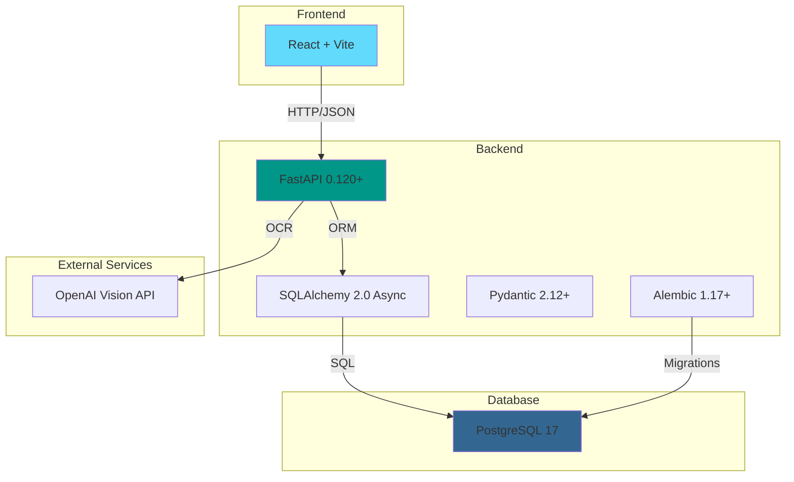
```mermaid
graph TB
    subgraph "Frontend"
        React[React + Vite]
    end

    subgraph "Backend"
        FastAPI[FastAPI 0.120+]
        SQLAlchemy[SQLAlchemy 2.0 Async]
        Pydantic[Pydantic 2.12+]
        Alembic[Alembic 1.17+]
    end

    subgraph "Database"
        PostgreSQL[PostgreSQL 17]
    end

    subgraph "External Services"
        OpenAI[OpenAI Vision API]
    end

    React -->|HTTP/JSON| FastAPI
    FastAPI -->|ORM| SQLAlchemy
    SQLAlchemy -->|SQL| PostgreSQL
    FastAPI -->|OCR| OpenAI
    Alembic -->|Migrations| PostgreSQL

    style FastAPI fill:#009688
    style PostgreSQL fill:#336791
    style React fill:#61dafb
```

## Arquitectura de Capas

### Diagrama de Capas

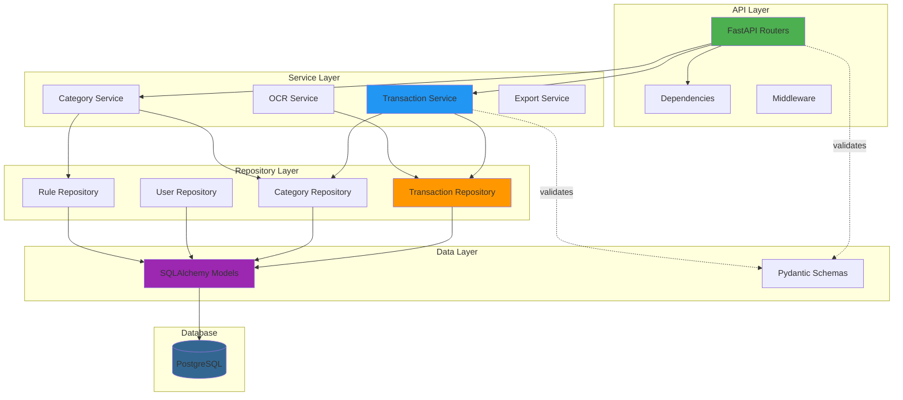
```mermaid
graph TD
    subgraph "API Layer"
        Router[FastAPI Routers]
        Deps[Dependencies]
        Middleware[Middleware]
    end

    subgraph "Service Layer"
        TransactionService[Transaction Service]
        CategoryService[Category Service]
        OcrService[OCR Service]
        ExportService[Export Service]
    end

    subgraph "Repository Layer"
        TransactionRepo[Transaction Repository]
        CategoryRepo[Category Repository]
        UserRepo[User Repository]
        RuleRepo[Rule Repository]
    end

    subgraph "Data Layer"
        Models[SQLAlchemy Models]
        Schemas[Pydantic Schemas]
    end

    subgraph "Database"
        PostgreSQL[(PostgreSQL)]
    end

    Router --> Deps
    Router --> TransactionService
    Router --> CategoryService

    TransactionService --> TransactionRepo
    TransactionService --> CategoryRepo
    CategoryService --> CategoryRepo
    CategoryService --> RuleRepo
    OcrService --> TransactionRepo

    TransactionRepo --> Models
    CategoryRepo --> Models
    UserRepo --> Models
    RuleRepo --> Models

    Models --> PostgreSQL

    Router -.validates.-> Schemas
    TransactionService -.validates.-> Schemas

    style Router fill:#4CAF50
    style TransactionService fill:#2196F3
    style TransactionRepo fill:#FF9800
    style Models fill:#9C27B0
    style PostgreSQL fill:#336791
```

### Responsabilidades por Capa

#### 1. API Layer (Routers)

- **Ubicación:** `app/api/v1/endpoints/`
- **Responsabilidades:**
  - Definir endpoints HTTP
  - Validar requests con Pydantic
  - Manejar autenticación/autorización
  - Formatear responses
  - Documentación OpenAPI

#### 2. Service Layer (Servicios)

- **Ubicación:** `app/services/`
- **Responsabilidades:**
  - Lógica de negocio
  - Validaciones complejas
  - Orquestación de repositorios
  - Aplicación de reglas de negocio
  - Transformación de datos

#### 3. Repository Layer (Repositorios)

- **Ubicación:** `app/repositories/`
- **Responsabilidades:**
  - Acceso a datos
  - Queries SQL (via ORM)
  - Operaciones CRUD
  - Filtrado y paginación
  - Transacciones de base de datos

#### 4. Data Layer (Modelos)

- **Ubicación:** `app/models/` y `app/schemas/`
- **Responsabilidades:**
  - Definición de estructura de datos
  - Validación de tipos
  - Mapeo ORM
  - Serialización/Deserialización

## Base de Datos

### Diagrama Entidad-Relación

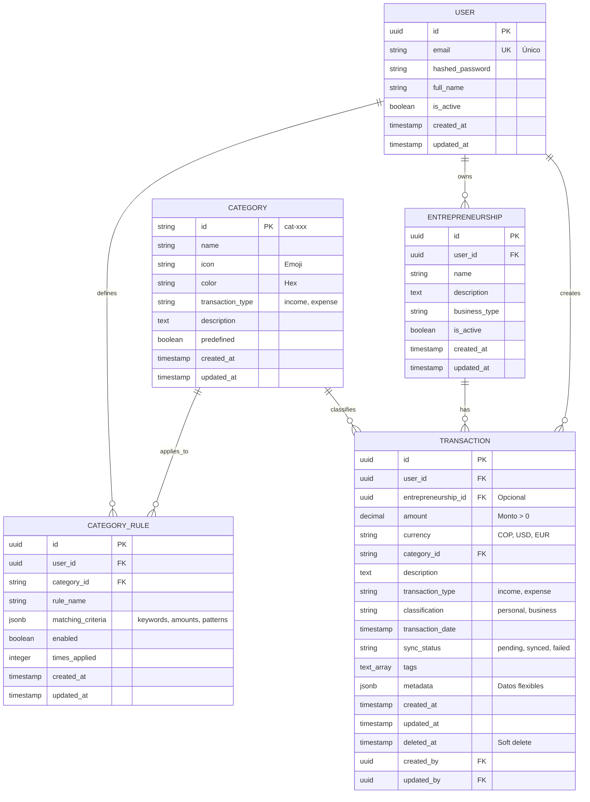
```mermaid
erDiagram
    USER ||--o{ TRANSACTION : creates
    USER ||--o{ ENTREPRENEURSHIP : owns
    USER ||--o{ CATEGORY_RULE : defines

    ENTREPRENEURSHIP ||--o{ TRANSACTION : has

    CATEGORY ||--o{ TRANSACTION : classifies
    CATEGORY ||--o{ CATEGORY_RULE : applies_to

    USER {
        uuid id PK
        string email UK "Único"
        string hashed_password
        string full_name
        boolean is_active
        timestamp created_at
        timestamp updated_at
    }

    ENTREPRENEURSHIP {
        uuid id PK
        uuid user_id FK
        string name
        text description
        string business_type
        boolean is_active
        timestamp created_at
        timestamp updated_at
    }

    TRANSACTION {
        uuid id PK
        uuid user_id FK
        uuid entrepreneurship_id FK "Opcional"
        decimal amount "Monto > 0"
        string currency "COP, USD, EUR"
        string category_id FK
        text description
        string transaction_type "income, expense"
        string classification "personal, business"
        timestamp transaction_date
        string sync_status "pending, synced, failed"
        text_array tags
        jsonb metadata "Datos flexibles"
        timestamp created_at
        timestamp updated_at
        timestamp deleted_at "Soft delete"
        uuid created_by FK
        uuid updated_by FK
    }

    CATEGORY {
        string id PK "cat-xxx"
        string name
        string icon "Emoji"
        string color "Hex"
        string transaction_type "income, expense"
        text description
        boolean predefined
        timestamp created_at
        timestamp updated_at
    }

    CATEGORY_RULE {
        uuid id PK
        uuid user_id FK
        string category_id FK
        string rule_name
        jsonb matching_criteria "keywords, amounts, patterns"
        boolean enabled
        integer times_applied
        timestamp created_at
        timestamp updated_at
    }
```

### Índices de Base de Datos

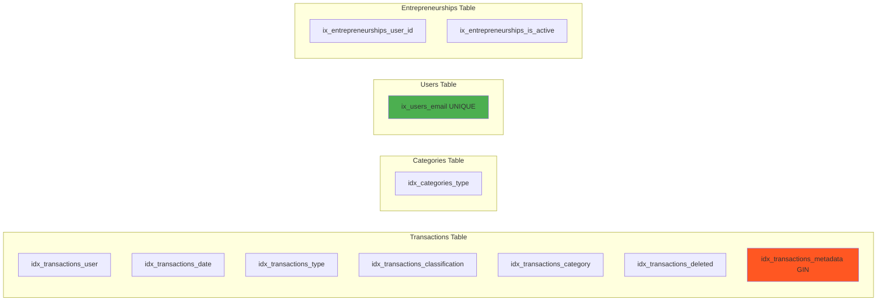
```mermaid
graph LR
    subgraph "Transactions Table"
        T1[idx_transactions_user]
        T2[idx_transactions_date]
        T3[idx_transactions_type]
        T4[idx_transactions_classification]
        T5[idx_transactions_category]
        T6[idx_transactions_deleted]
        T7[idx_transactions_metadata GIN]
    end

    subgraph "Categories Table"
        C1[idx_categories_type]
    end

    subgraph "Users Table"
        U1[ix_users_email UNIQUE]
    end

    subgraph "Entrepreneurships Table"
        E1[ix_entrepreneurships_user_id]
        E2[ix_entrepreneurships_is_active]
    end

    style T7 fill:#FF5722
    style U1 fill:#4CAF50
```

**Propósito de los índices:**

- **user_id:** Filtrar transacciones por usuario (query más común)
- **transaction_date:** Ordenar y filtrar por fecha
- **transaction_type:** Filtrar ingresos vs gastos
- **classification:** Filtrar personal vs business
- **deleted_at:** Excluir registros eliminados (soft delete)
- **metadata (GIN):** Búsquedas en JSONB (OCR data, etc.)

### Estrategia de Soft Delete

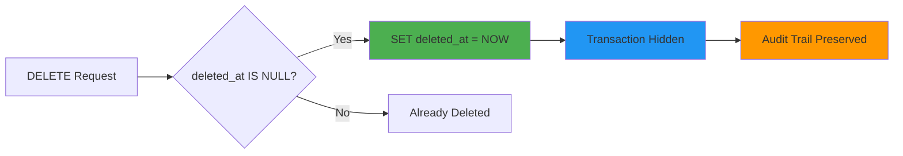
```mermaid
graph LR
    A[DELETE Request] --> B{deleted_at IS NULL?}
    B -->|Yes| C[SET deleted_at = NOW]
    B -->|No| D[Already Deleted]
    C --> E[Transaction Hidden]
    E --> F[Audit Trail Preserved]

    style C fill:#4CAF50
    style E fill:#2196F3
    style F fill:#FF9800
```

**Beneficios:**

- ✅ Auditoría completa
- ✅ Recuperación de datos
- ✅ Análisis histórico
- ✅ Cumplimiento normativo

## API REST

### Estructura de Endpoints

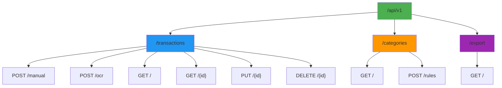
```mermaid
graph TD
    API["/api/v1"]

    API --> T["/transactions"]
    API --> C["/categories"]
    API --> E["/export"]

    T --> T1["POST /manual"]
    T --> T2["POST /ocr"]
    T --> T3["GET /"]
    T --> T4["GET /{id}"]
    T --> T5["PUT /{id}"]
    T --> T6["DELETE /{id}"]

    C --> C1["GET /"]
    C --> C2["POST /rules"]

    E --> E1["GET /"]

    style API fill:#4CAF50
    style T fill:#2196F3
    style C fill:#FF9800
    style E fill:#9C27B0
```

### Request/Response Flow

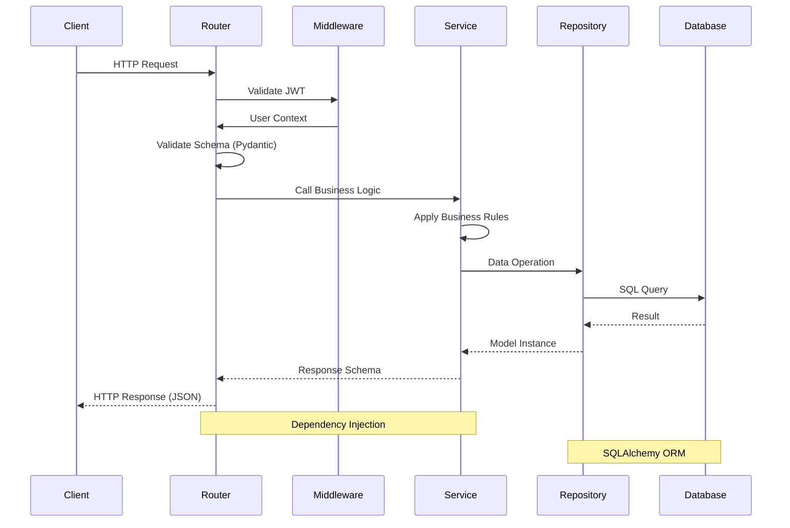
```mermaid
sequenceDiagram
    participant Client
    participant Router
    participant Middleware
    participant Service
    participant Repository
    participant Database

    Client->>Router: HTTP Request
    Router->>Middleware: Validate JWT
    Middleware->>Router: User Context
    Router->>Router: Validate Schema (Pydantic)
    Router->>Service: Call Business Logic
    Service->>Service: Apply Business Rules
    Service->>Repository: Data Operation
    Repository->>Database: SQL Query
    Database-->>Repository: Result
    Repository-->>Service: Model Instance
    Service-->>Router: Response Schema
    Router-->>Client: HTTP Response (JSON)

    Note over Router,Service: Dependency Injection
    Note over Repository,Database: SQLAlchemy ORM
```

### Validación de Datos

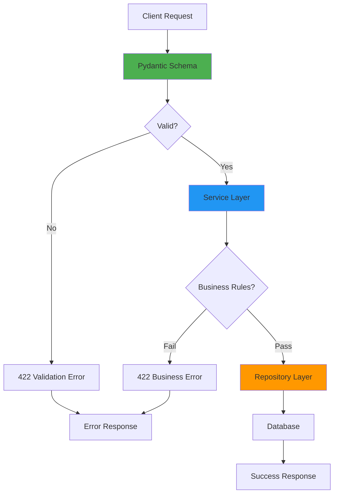
```mermaid
graph TD
    A[Client Request] --> B[Pydantic Schema]
    B --> C{Valid?}
    C -->|No| D[422 Validation Error]
    C -->|Yes| E[Service Layer]
    E --> F{Business Rules?}
    F -->|Fail| G[422 Business Error]
    F -->|Pass| H[Repository Layer]
    H --> I[Database]

    D --> J[Error Response]
    G --> J
    I --> K[Success Response]

    style B fill:#4CAF50
    style E fill:#2196F3
    style H fill:#FF9800
```

**Niveles de validación:**

1. **Schema Validation (Pydantic):**

   - Tipos de datos
   - Rangos de valores
   - Formatos (email, UUID, etc.)
   - Campos requeridos

2. **Business Validation (Service):**

   - Categoría existe
   - Tipo de categoría coincide
   - Usuario tiene permisos
   - Reglas de negocio

3. **Database Constraints:**
   - Foreign keys
   - Unique constraints
   - Check constraints
   - NOT NULL

## Flujos de Trabajo

### Flujo: Crear Transacción Manual

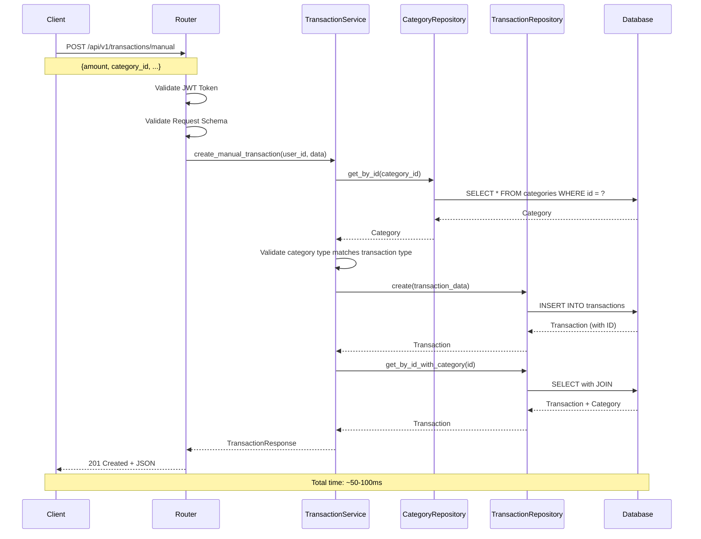
```mermaid
sequenceDiagram
    participant C as Client
    participant R as Router
    participant TS as TransactionService
    participant CR as CategoryRepository
    participant TR as TransactionRepository
    participant DB as Database

    C->>R: POST /api/v1/transactions/manual
    Note over C,R: {amount, category_id, ...}

    R->>R: Validate JWT Token
    R->>R: Validate Request Schema

    R->>TS: create_manual_transaction(user_id, data)

    TS->>CR: get_by_id(category_id)
    CR->>DB: SELECT * FROM categories WHERE id = ?
    DB-->>CR: Category
    CR-->>TS: Category

    TS->>TS: Validate category type matches transaction type

    TS->>TR: create(transaction_data)
    TR->>DB: INSERT INTO transactions
    DB-->>TR: Transaction (with ID)
    TR-->>TS: Transaction

    TS->>TR: get_by_id_with_category(id)
    TR->>DB: SELECT with JOIN
    DB-->>TR: Transaction + Category
    TR-->>TS: Transaction

    TS-->>R: TransactionResponse
    R-->>C: 201 Created + JSON

    Note over C,DB: Total time: ~50-100ms
```

### Flujo: Listar Transacciones con Filtros

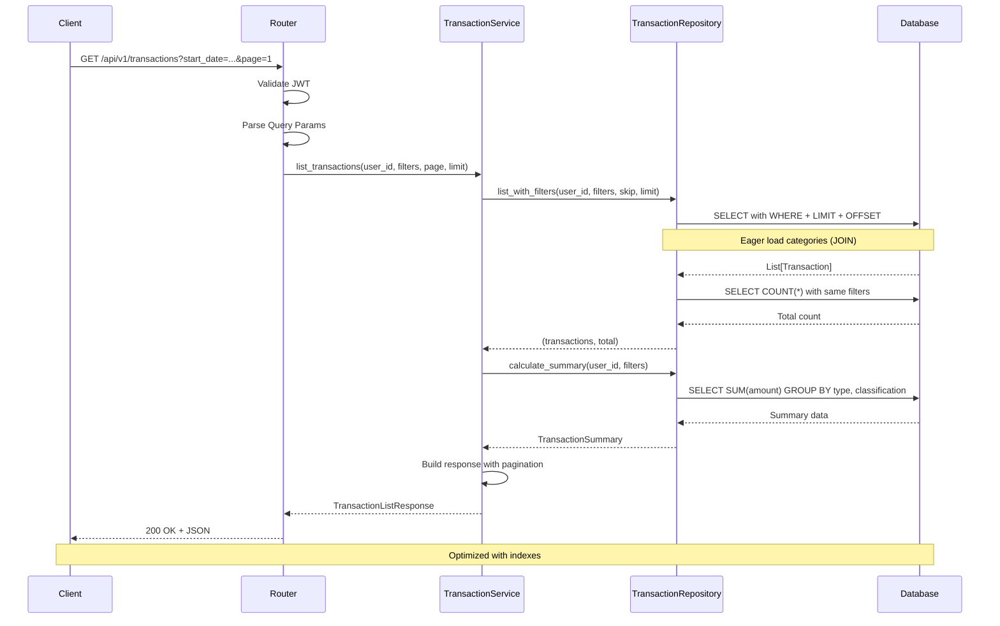
```mermaid
sequenceDiagram
    participant C as Client
    participant R as Router
    participant TS as TransactionService
    participant TR as TransactionRepository
    participant DB as Database

    C->>R: GET /api/v1/transactions?start_date=...&page=1

    R->>R: Validate JWT
    R->>R: Parse Query Params

    R->>TS: list_transactions(user_id, filters, page, limit)

    TS->>TR: list_with_filters(user_id, filters, skip, limit)

    TR->>DB: SELECT with WHERE + LIMIT + OFFSET
    Note over TR,DB: Eager load categories (JOIN)
    DB-->>TR: List[Transaction]

    TR->>DB: SELECT COUNT(*) with same filters
    DB-->>TR: Total count

    TR-->>TS: (transactions, total)

    TS->>TR: calculate_summary(user_id, filters)
    TR->>DB: SELECT SUM(amount) GROUP BY type, classification
    DB-->>TR: Summary data
    TR-->>TS: TransactionSummary

    TS->>TS: Build response with pagination
    TS-->>R: TransactionListResponse
    R-->>C: 200 OK + JSON

    Note over C,DB: Optimized with indexes
```

### Flujo: Actualizar Transacción

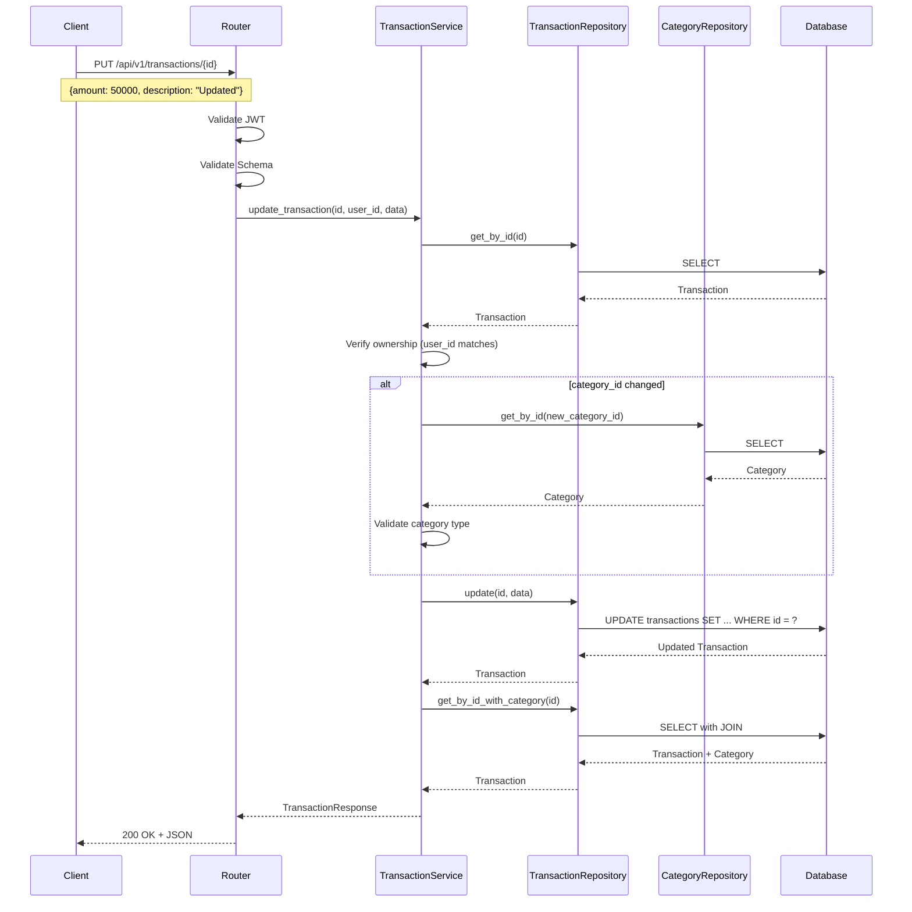
```mermaid
sequenceDiagram
    participant C as Client
    participant R as Router
    participant TS as TransactionService
    participant TR as TransactionRepository
    participant CR as CategoryRepository
    participant DB as Database

    C->>R: PUT /api/v1/transactions/{id}
    Note over C,R: {amount: 50000, description: "Updated"}

    R->>R: Validate JWT
    R->>R: Validate Schema

    R->>TS: update_transaction(id, user_id, data)

    TS->>TR: get_by_id(id)
    TR->>DB: SELECT
    DB-->>TR: Transaction
    TR-->>TS: Transaction

    TS->>TS: Verify ownership (user_id matches)

    alt category_id changed
        TS->>CR: get_by_id(new_category_id)
        CR->>DB: SELECT
        DB-->>CR: Category
        CR-->>TS: Category
        TS->>TS: Validate category type
    end

    TS->>TR: update(id, data)
    TR->>DB: UPDATE transactions SET ... WHERE id = ?
    DB-->>TR: Updated Transaction
    TR-->>TS: Transaction

    TS->>TR: get_by_id_with_category(id)
    TR->>DB: SELECT with JOIN
    DB-->>TR: Transaction + Category
    TR-->>TS: Transaction

    TS-->>R: TransactionResponse
    R-->>C: 200 OK + JSON
```

### Flujo: Soft Delete

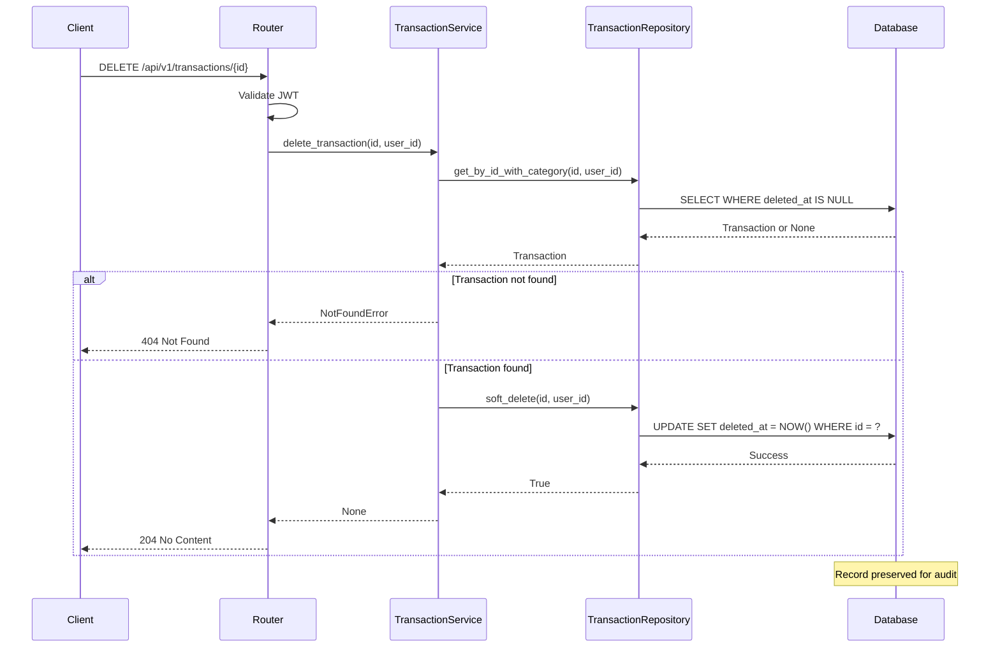
```mermaid
sequenceDiagram
    participant C as Client
    participant R as Router
    participant TS as TransactionService
    participant TR as TransactionRepository
    participant DB as Database

    C->>R: DELETE /api/v1/transactions/{id}

    R->>R: Validate JWT

    R->>TS: delete_transaction(id, user_id)

    TS->>TR: get_by_id_with_category(id, user_id)
    TR->>DB: SELECT WHERE deleted_at IS NULL
    DB-->>TR: Transaction or None
    TR-->>TS: Transaction

    alt Transaction not found
        TS-->>R: NotFoundError
        R-->>C: 404 Not Found
    else Transaction found
        TS->>TR: soft_delete(id, user_id)
        TR->>DB: UPDATE SET deleted_at = NOW() WHERE id = ?
        DB-->>TR: Success
        TR-->>TS: True
        TS-->>R: None
        R-->>C: 204 No Content
    end

    Note over DB: Record preserved for audit
```

## Seguridad

### Autenticación JWT (Estructura Base)

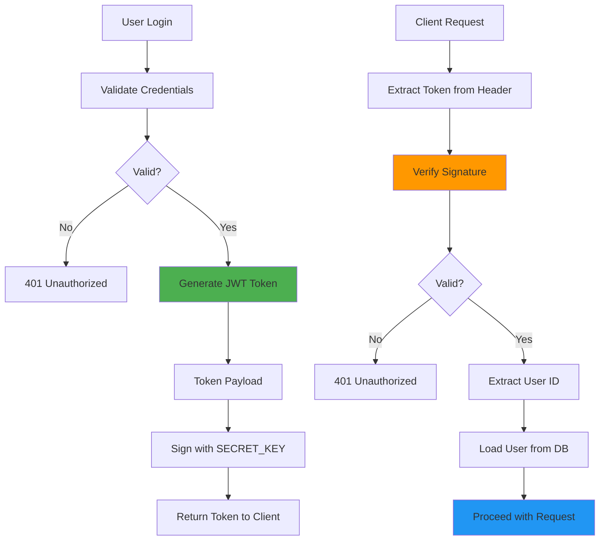
```mermaid
graph TD
    A[User Login] --> B[Validate Credentials]
    B --> C{Valid?}
    C -->|No| D[401 Unauthorized]
    C -->|Yes| E[Generate JWT Token]
    E --> F[Token Payload]
    F --> G[Sign with SECRET_KEY]
    G --> H[Return Token to Client]

    I[Client Request] --> J[Extract Token from Header]
    J --> K[Verify Signature]
    K --> L{Valid?}
    L -->|No| M[401 Unauthorized]
    L -->|Yes| N[Extract User ID]
    N --> O[Load User from DB]
    O --> P[Proceed with Request]

    style E fill:#4CAF50
    style K fill:#FF9800
    style P fill:#2196F3
```

**Token Structure:**

```json
{
  "sub": "user-uuid",
  "exp": 1698765432,
  "iat": 1698679032
}
```

### Manejo de Errores

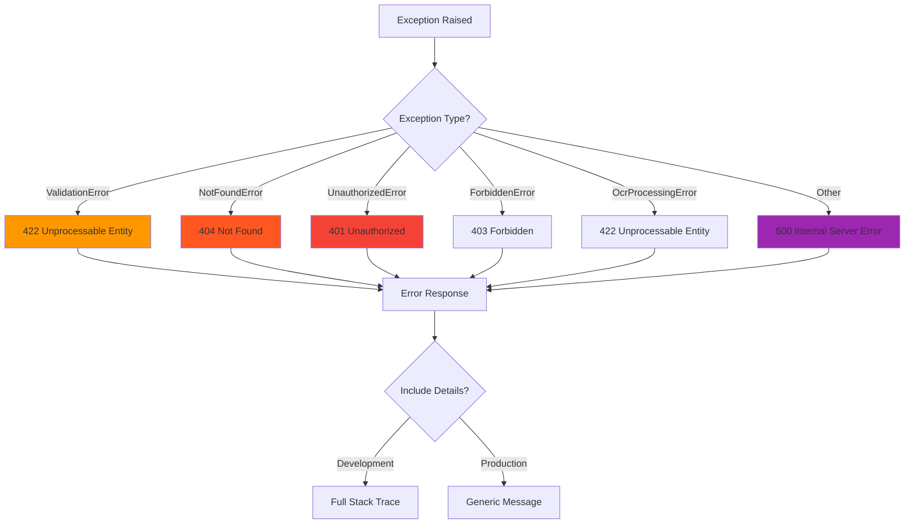
```mermaid
graph TD
    A[Exception Raised] --> B{Exception Type?}

    B -->|ValidationError| C[422 Unprocessable Entity]
    B -->|NotFoundError| D[404 Not Found]
    B -->|UnauthorizedError| E[401 Unauthorized]
    B -->|ForbiddenError| F[403 Forbidden]
    B -->|OcrProcessingError| G[422 Unprocessable Entity]
    B -->|Other| H[500 Internal Server Error]

    C --> I[Error Response]
    D --> I
    E --> I
    F --> I
    G --> I
    H --> I

    I --> J{Include Details?}
    J -->|Development| K[Full Stack Trace]
    J -->|Production| L[Generic Message]

    style C fill:#FF9800
    style D fill:#FF5722
    style E fill:#F44336
    style H fill:#9C27B0
```

**Error Response Format:**

```json
{
  "code": "INVALID_CATEGORY",
  "message": "Category 'cat-xxx' not found",
  "details": {
    "field": "category_id",
    "value": "cat-xxx"
  },
  "timestamp": "2025-10-28T19:00:00Z"
}
```

### CORS Configuration

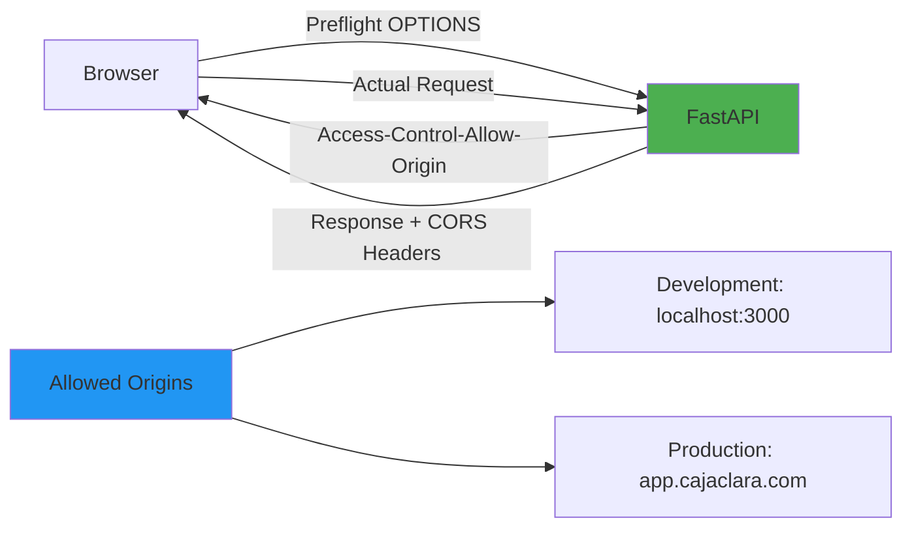
```mermaid
graph LR
    A[Browser] -->|Preflight OPTIONS| B[FastAPI]
    B -->|Access-Control-Allow-Origin| A
    A -->|Actual Request| B
    B -->|Response + CORS Headers| A

    C[Allowed Origins] --> D[Development: localhost:3000]
    C --> E[Production: app.cajaclara.com]

    style B fill:#4CAF50
    style C fill:#2196F3
```

## Performance y Optimización

### Database Query Optimization

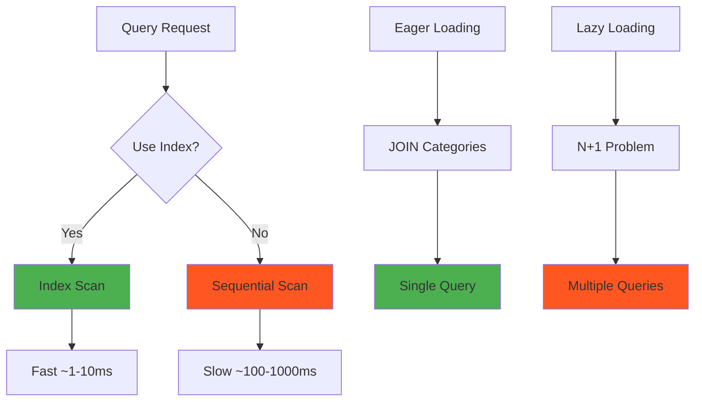
```mermaid
graph TD
    A[Query Request] --> B{Use Index?}
    B -->|Yes| C[Index Scan]
    B -->|No| D[Sequential Scan]

    C --> E[Fast ~1-10ms]
    D --> F[Slow ~100-1000ms]

    G[Eager Loading] --> H[JOIN Categories]
    H --> I[Single Query]

    J[Lazy Loading] --> K[N+1 Problem]
    K --> L[Multiple Queries]

    style C fill:#4CAF50
    style D fill:#FF5722
    style I fill:#4CAF50
    style L fill:#FF5722
```

**Optimizaciones implementadas:**

- ✅ Índices en columnas frecuentemente filtradas
- ✅ Eager loading de relaciones (JOIN)
- ✅ Paginación para limitar resultados
- ✅ Connection pooling
- ✅ Async I/O (no bloquea el event loop)

### Caching Strategy (Futuro)

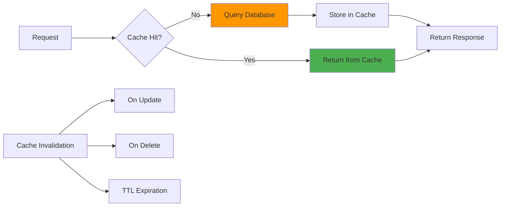
```mermaid
graph LR
    A[Request] --> B{Cache Hit?}
    B -->|Yes| C[Return from Cache]
    B -->|No| D[Query Database]
    D --> E[Store in Cache]
    E --> F[Return Response]
    C --> F

    G[Cache Invalidation] --> H[On Update]
    G --> I[On Delete]
    G --> J[TTL Expiration]

    style C fill:#4CAF50
    style D fill:#FF9800
```

## Escalabilidad

### Horizontal Scaling

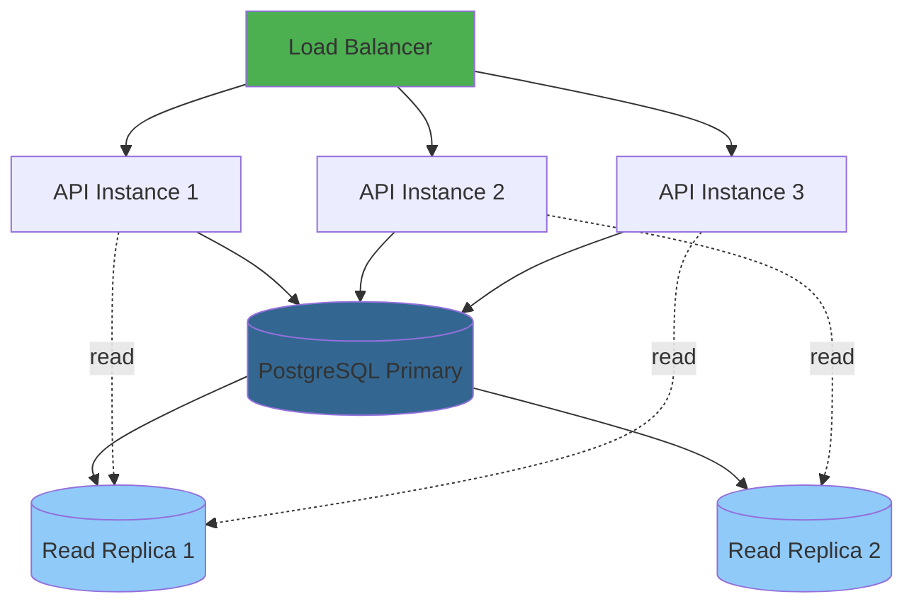
```mermaid
graph TD
    LB[Load Balancer] --> A1[API Instance 1]
    LB --> A2[API Instance 2]
    LB --> A3[API Instance 3]

    A1 --> DB[(PostgreSQL Primary)]
    A2 --> DB
    A3 --> DB

    DB --> R1[(Read Replica 1)]
    DB --> R2[(Read Replica 2)]

    A1 -.read.-> R1
    A2 -.read.-> R2
    A3 -.read.-> R1

    style LB fill:#4CAF50
    style DB fill:#336791
    style R1 fill:#90CAF9
    style R2 fill:#90CAF9
```

**Consideraciones:**

- Stateless API (JWT en cada request)
- Shared database (PostgreSQL)
- Read replicas para queries pesados
- Connection pooling por instancia

## Monitoreo y Observabilidad

### Logging Structure

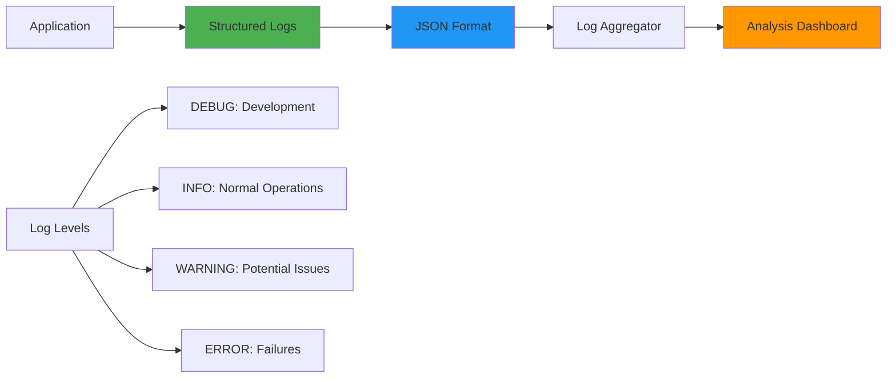
```mermaid
graph LR
    A[Application] --> B[Structured Logs]
    B --> C[JSON Format]
    C --> D[Log Aggregator]
    D --> E[Analysis Dashboard]

    F[Log Levels] --> G[DEBUG: Development]
    F --> H[INFO: Normal Operations]
    F --> I[WARNING: Potential Issues]
    F --> J[ERROR: Failures]

    style B fill:#4CAF50
    style C fill:#2196F3
    style E fill:#FF9800
```

**Log Example:**

```json
{
  "timestamp": "2025-10-28T19:00:00Z",
  "level": "INFO",
  "event": "transaction_created",
  "transaction_id": "uuid",
  "user_id": "uuid",
  "amount": 45000,
  "type": "expense"
}
```

## Referencias

- [FastAPI Documentation](https://fastapi.tiangolo.com/)
- [SQLAlchemy 2.0 Documentation](https://docs.sqlalchemy.org/en/20/)
- [Pydantic Documentation](https://docs.pydantic.dev/)
- [PostgreSQL Documentation](https://www.postgresql.org/docs/)
- [Alembic Documentation](https://alembic.sqlalchemy.org/)

---

**Última actualización:** 2025-10-28  
**Versión:** 1.0.0
