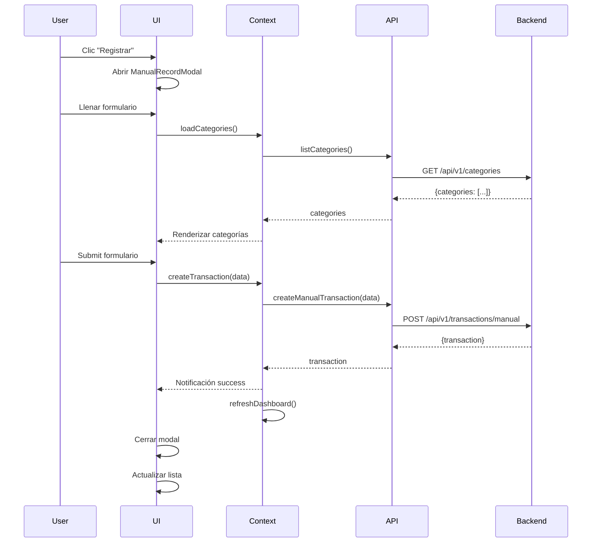

# Arquitectura del Frontend CajaClara

## 📋 Tabla de Contenidos

- [Visión General](#visión-general)
- [Estructura de Carpetas](#estructura-de-carpetas)
- [Componentes Principales](#componentes-principales)
- [Flujo de Datos](#flujo-de-datos)
- [Integración con Backend](#integración-con-backend)
- [Estado y Context API](#estado-y-context-api)
- [Rutas y Navegación](#rutas-y-navegación)

## Visión General

El frontend de CajaClara está construido con **React 18** + **Vite**, manteniendo toda la funcionalidad del MVP original en HTML pero completamente integrado con el backend FastAPI.

### Stack Tecnológico

- **React 18** - UI Library
- **Vite** - Build tool
- **Context API** - State management
- **Fetch API** - HTTP client
- **CSS Modules** - Styling (con CSS del MVP original)
- **Font Awesome** - Icons

## Estructura de Carpetas

```
frontend/
├── src/
│   ├── components/           # Componentes React
│   │   ├── common/          # Componentes reutilizables
│   │   │   ├── Button.jsx
│   │   │   ├── Input.jsx
│   │   │   ├── Modal.jsx
│   │   │   ├── Notification.jsx
│   │   │   └── Loading.jsx
│   │   ├── auth/            # Componentes de autenticación
│   │   │   ├── LoginPage.jsx
│   │   │   └── GuestLogin.jsx
│   │   ├── dashboard/       # Dashboard y navegación
│   │   │   ├── Dashboard.jsx
│   │   │   ├── Header.jsx
│   │   │   ├── CashCard.jsx
│   │   │   ├── GaugesCard.jsx
│   │   │   ├── DateSelector.jsx
│   │   │   ├── AccountsCard.jsx
│   │   │   └── WorkflowInfo.jsx
│   │   ├── transactions/    # Gestión de transacciones
│   │   │   ├── ManualRecordModal.jsx
│   │   │   ├── VisualRecordModal.jsx
│   │   │   ├── TransactionsList.jsx
│   │   │   ├── TransactionItem.jsx
│   │   │   └── TransactionFilters.jsx
│   │   ├── accounts/        # Gestión de cuentas
│   │   │   ├── AccountsPage.jsx
│   │   │   ├── AccountCard.jsx
│   │   │   └── AddAccountModal.jsx
│   │   └── reports/         # Reportes
│   │       ├── ReportsPage.jsx
│   │       └── ReportCard.jsx
│   ├── context/             # Context API
│   │   └── AppContext.jsx   # ✅ Creado
│   ├── services/            # Servicios API
│   │   └── api.js           # ✅ Creado
│   ├── hooks/               # Custom hooks
│   │   ├── useTransactions.js
│   │   ├── useCategories.js
│   │   └── useAuth.js
│   ├── utils/               # Utilidades
│   │   ├── formatters.js
│   │   ├── validators.js
│   │   └── constants.js
│   ├── styles/              # Estilos globales
│   │   └── globals.css      # ✅ Creado
│   ├── App.jsx              # Componente principal
│   └── main.jsx             # Entry point
├── .env                     # ✅ Creado
├── .env.example             # Existe
├── index.html
├── package.json             # Existe
└── vite.config.js
```

## Componentes Principales

### 1. App.jsx (Root Component)

```jsx
<AppProvider>
  <Router>
    <Routes>
      <Route path="/login" element={<LoginPage />} />
      <Route path="/" element={<ProtectedRoute />}>
        <Route index element={<Dashboard />} />
        <Route path="transactions" element={<TransactionsList />} />
        <Route path="accounts" element={<AccountsPage />} />
        <Route path="reports" element={<ReportsPage />} />
      </Route>
    </Routes>
  </Router>
  <NotificationContainer />
</AppProvider>
```

### 2. Dashboard.jsx

Componente principal que renderiza:
- Header con navegación
- WorkflowInfo (pasos del flujo)
- API Status indicator
- CashCard (total en caja)
- GaugesCard (balance, cashflow, spending)
- DateSelector (selector de período)
- AccountsCard (lista de cuentas)

### 3. Header.jsx

- Logo y navegación
- Dropdown "Registrar" con opciones:
  - Registro Manual
  - Registro Visual (OCR)
  - Ver Registros
- Avatar de usuario

### 4. ManualRecordModal.jsx

Modal para registro manual de transacciones:
- Tabs: Gasto / Ingreso / Transferencia
- Formulario con validación:
  - Monto (requerido)
  - Cuenta (requerido)
  - Categoría (requerido, dinámicamente cargada del backend)
  - Etiquetas
  - Fecha/Hora
  - Nota, Pagador, Tipo de pago, Estado
- Botones: Cancelar / Agregar / Agregar y crear otro

**Integración API:**
```javascript
const handleSubmit = async (formData) => {
  try {
    const transaction = await createTransaction({
      amount: parseFloat(formData.amount),
      currency: 'COP',
      category_id: formData.category,
      description: formData.note,
      transaction_type: activeTab, // 'expense' | 'income'
      classification: formData.classification,
      transaction_date: formData.datetime,
      tags: formData.tags,
    });
    
    showNotification('Transacción registrada', 'success');
    refreshDashboard();
  } catch (error) {
    showNotification(error.message, 'error');
  }
};
```

### 5. VisualRecordModal.jsx

Modal para registro por OCR:
- Tabs: Subir Imagen / Manual
- Área de drag & drop para imágenes
- Preview de imagen
- Formulario pre-poblado con datos extraídos del OCR
- Indicadores de confianza del OCR

**Integración API:**
```javascript
const handleImageUpload = async (file) => {
  const formData = new FormData();
  formData.append('receipt_image', file);
  formData.append('transaction_type', 'expense');
  formData.append('classification', 'business');

  try {
    const result = await createOcrTransaction(formData);
    
    // Pre-poblar formulario con datos OCR
    setFormData({
      amount: result.amount,
      category: result.category.id,
      date: result.transaction_date,
      description: result.description,
    });
    
    // Mostrar confianza del OCR
    setOcrConfidence(result.metadata.ocr_confidence);
  } catch (error) {
    showNotification('Error procesando imagen', 'error');
  }
};
```

### 6. TransactionsList.jsx

Página de listado de transacciones:
- Filtros:
  - Búsqueda por texto
  - Tipo (todos, ingresos, gastos)
  - Categoría
  - Rango de fechas
- Lista paginada de transacciones
- Botón exportar
- Acciones por transacción: Editar / Eliminar

**Integración API:**
```javascript
useEffect(() => {
  const fetchTransactions = async () => {
    try {
      const response = await listTransactions(filters, page, 20);
      setTransactions(response.transactions);
      setPagination(response.pagination);
      setSummary(response.summary);
    } catch (error) {
      showNotification('Error cargando transacciones', 'error');
    }
  };

  fetchTransactions();
}, [filters, page]);
```

## Flujo de Datos

### Flujo de Creación de Transacción



## Integración con Backend

### Endpoints Consumidos

| Método | Endpoint | Componente | Descripción |
|--------|----------|------------|-------------|
| POST | `/api/v1/transactions/manual` | ManualRecordModal | Crear transacción manual |
| POST | `/api/v1/transactions/ocr` | VisualRecordModal | Crear por OCR |
| GET | `/api/v1/transactions` | TransactionsList, Dashboard | Listar transacciones |
| GET | `/api/v1/transactions/{id}` | TransactionItem | Detalle |
| PUT | `/api/v1/transactions/{id}` | TransactionItem | Actualizar |
| DELETE | `/api/v1/transactions/{id}` | TransactionItem | Eliminar |
| GET | `/api/v1/categories` | Todos | Listar categorías |
| GET | `/api/v1/transactions/export` | TransactionsList | Exportar |

### Manejo de Errores

```javascript
try {
  const transaction = await createTransaction(data);
  showNotification('Éxito', 'success');
} catch (error) {
  if (error instanceof ApiError) {
    switch (error.code) {
      case 'INVALID_CATEGORY':
        showNotification('Categoría inválida', 'error');
        break;
      case 'NETWORK_ERROR':
        showNotification('Error de conexión', 'error');
        break;
      default:
        showNotification(error.message, 'error');
    }
  }
}
```

## Estado y Context API

### AppContext

Proporciona:
- **Autenticación:** `user`, `isAuthenticated`, `login()`, `logout()`
- **Categorías:** `categories`, `loadCategories()`, `getCategoriesByType()`
- **Transacciones:** `transactions`, `createTransaction()`, `updateTransaction()`, `deleteTransaction()`
- **Notificaciones:** `notifications`, `showNotification()`, `removeNotification()`
- **Loading:** `globalLoading`, `authLoading`, `categoriesLoading`

### Uso en Componentes

```javascript
import { useApp } from '../context/AppContext';

function MyComponent() {
  const {
    categories,
    createTransaction,
    showNotification,
    getCategoriesByType
  } = useApp();

  const expenseCategories = getCategoriesByType('expense');

  const handleSubmit = async (data) => {
    try {
      await createTransaction(data);
      showNotification('Transacción creada', 'success');
    } catch (error) {
      showNotification(error.message, 'error');
    }
  };

  return (
    // ...
  );
}
```

## Rutas y Navegación

```javascript
// Sin React Router (MVP simplificado)
const [currentPage, setCurrentPage] = useState('dashboard');

const pages = {
  dashboard: <Dashboard />,
  transactions: <TransactionsList />,
  accounts: <AccountsPage />,
  reports: <ReportsPage />,
};

return isAuthenticated ? (
  <div>
    <Header currentPage={currentPage} setCurrentPage={setCurrentPage} />
    {pages[currentPage]}
  </div>
) : (
  <LoginPage />
);
```

## Validación de Formularios

### Schema de Validación (sincronizado con backend)

```javascript
const transactionSchema = {
  amount: {
    required: true,
    min: 0.01,
    type: 'number'
  },
  currency: {
    required: true,
    enum: ['COP', 'USD', 'EUR']
  },
  category_id: {
    required: true,
    maxLength: 50
  },
  description: {
    required: false,
    maxLength: 500
  },
  transaction_type: {
    required: true,
    enum: ['income', 'expense']
  },
  classification: {
    required: true,
    enum: ['personal', 'business']
  },
  transaction_date: {
    required: true,
    type: 'datetime'
  }
};
```

## Performance

### Optimizaciones Implementadas

1. **Caching de categorías** - Las categorías se cargan una vez y se cachean en el contexto
2. **Lazy loading de transacciones** - Paginación con scroll infinito
3. **Debouncing de búsqueda** - 300ms delay en filtros de búsqueda
4. **Memoization** - `useMemo` para cálculos costosos
5. **Optimistic UI** - Actualización inmediata antes de confirmación del backend

## Testing (Pendiente)

- Tests unitarios con **Vitest**
- Tests de integración con **React Testing Library**
- E2E tests con **Playwright**

---

**Versión:** 1.0.0  
**Última actualización:** 2025-10-29